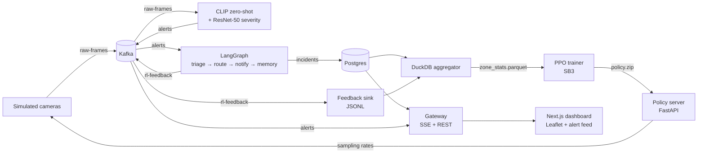

# UrbanGuard

Real-time city safety intelligence platform. Simulated CCTV streams flow through Kafka into a two-stage neural detector (CLIP zero-shot filter + a fine-tuned ResNet-50 severity scorer), get triaged by a LangGraph multi-agent pipeline, and feed a PPO reinforcement-learning policy that learns which city zones deserve more compute as incident patterns shift.

Runs end-to-end on a single laptop. Apple Silicon supported via MPS.

## System architecture



## What's inside

| Service | Purpose |
|---|---|
| `services/ingest` | Simulated camera fleet → `raw-frames` Kafka topic |
| `services/detect` | CLIP zero-shot → ResNet-50 severity → `alerts` topic |
| `services/agents` | LangGraph triage / route / notify / memory pipeline |
| `services/rl` | PPO zone-priority policy + policy server + feedback sink |
| `services/replay` | DuckDB aggregator + Kafka offset rewind |
| `services/gateway` | FastAPI SSE bridge + REST endpoints for the dashboard |
| `shared/` | Pydantic models, topics, settings, Kafka helpers, observability |
| `frontend/` | Next.js 15 + Leaflet dashboard with live alert feed |
| `infra/` | Docker, Kafka init, Postgres multi-db, optional AWS Lambda SAM |

## Stack

Python 3.12 · uv workspaces · FastAPI · aiokafka · PyTorch (MPS) · open_clip ViT-B-32 · ResNet-50 · LangGraph + Gemini/Groq · Stable-Baselines3 PPO · DuckDB · Postgres · Redis · MinIO · Langfuse · Next.js 15 · Leaflet · OpenStreetMap + OSRM.

Heavy training runs on Google Colab (free T4); the local stack runs entirely on a 16 GB Apple Silicon laptop.

## Quick start

```bash
uv sync --all-packages
make up                              # docker compose: kafka, redis, postgres, minio, langfuse
make ingest                          # in a second terminal — FastAPI camera control
make detect                          # in a third — CLIP + ResNet on raw-frames
make agents                          # LangGraph triage → route → notify → memory
make gateway                         # FastAPI SSE + REST for the frontend
cd frontend && npm install && npm run dev   # http://localhost:3000
```

## Running tests

```bash
uv run pytest                                          # 36 tests; integration tests skip if docker is down
URBANGUARD_RUN_MODELS=1 uv run pytest services/detect/ # opt-in: downloads CLIP + ResNet weights
URBANGUARD_RL_SMOKE=1 uv run pytest services/rl/       # opt-in: 2K-step PPO training
make lint && make test                                 # CI also runs these
```

## Datasets

The repo doesn't ship video data — `data/` is gitignored. Pull from the three sources via:

```bash
uv run python scripts/download_datasets.py nexar              # ~250 MB sample (default)
uv run python scripts/download_datasets.py hwid12             # Kaggle, needs ~/.kaggle/kaggle.json
uv run python scripts/download_datasets.py dota               # clones the repo; YouTube pulls are manual
```

Full datasets, contents, licenses, and the developer-perspective story of how each was discovered are in [`docs/datasets.md`](docs/datasets.md).

## What's deliberately not here
- The cloud bridge in `infra/lambda/` is a stub. The plan is "local-first, cloud-optional"; deploying needs an AWS account with billing.
- `frontend/` ships only the essentials — alert feed + Leaflet heatmap. Polish (shadcn theme, RL policy bar chart, agent trace iframe) is a follow-up.

## Repo layout

See [`docs/architecture.md`](docs/architecture.md) for the directory tour. Each phase of the build is checkpointed in git history — `git log --oneline` reads as a story.
